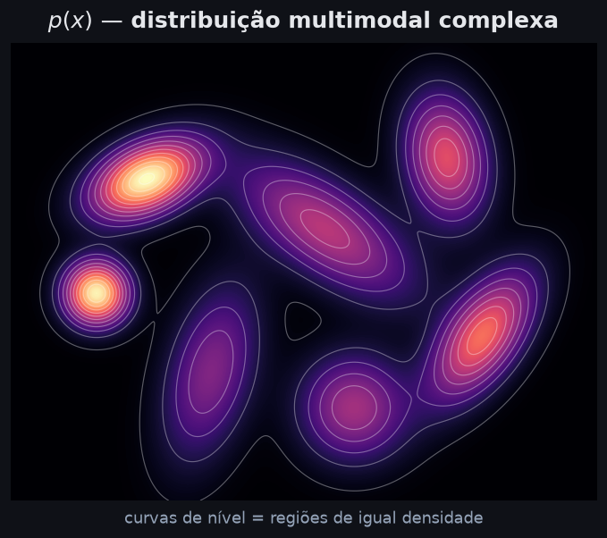
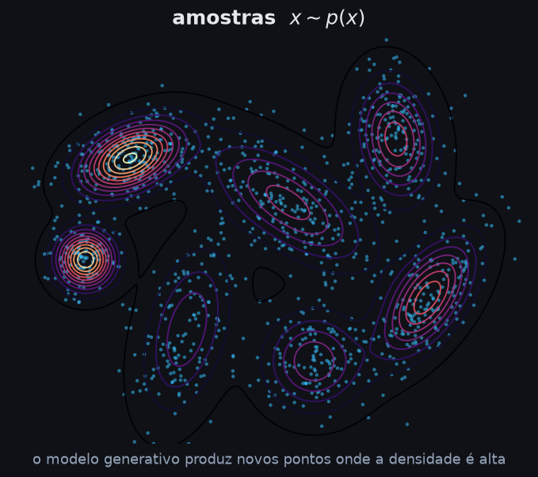
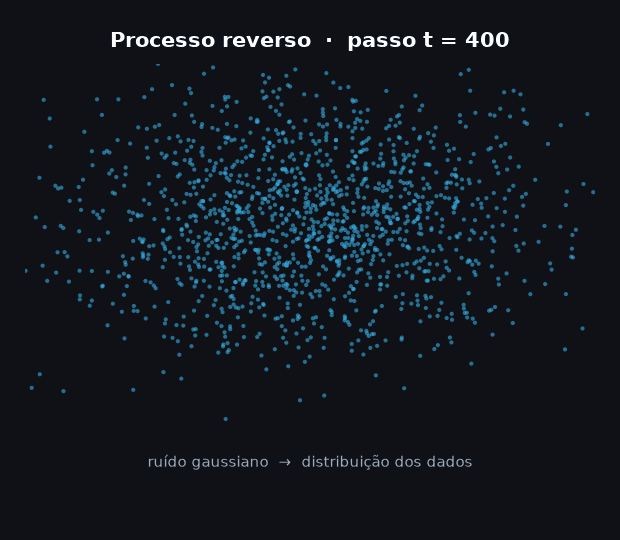
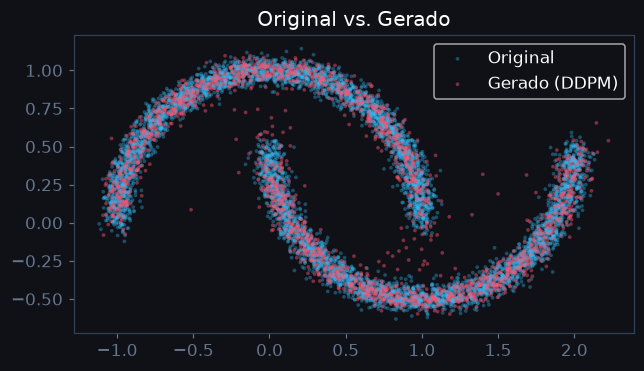

# Modelos de Difusão

## Gerando Imagens do Nada ao Fotorrealismo

Daniel · Turma de Graduação

<!--
Apresente-se e pergunte: "Alguém já usou Midjourney, DALL-E ou Stable Diffusion?"
-->

---

# Roteiro da Aula

1. **Motivação** — por que gerar imagens é difícil?
2. **Panorama** — família de modelos generativos
3. **A ideia central** — destruir e reconstruir
4. **Processo direto** — adicionando ruído
5. **Processo reverso** — aprendendo a denoisar
6. **Treinamento e amostragem**
7. **Acelerando: DDIM**
8. **Condicionamento** — texto → imagem
9. **Stable Diffusion** — escala e latentes
10. **Aplicações, limitações e ética**

*Duração estimada: 1h30 – 2h*

---
layout: center
---

# Parte 1
## Motivação

---

# Por que gerar imagens é difícil?

Uma imagem 256×256 RGB tem **196.608 pixels**.

Cada pixel pode ter valores de 0 a 255.

O número de imagens possíveis é astronômico:

$$256^{196608} \approx 10^{473.000}$$

Imagens **realistas** ocupam uma fração minúscula desse espaço.

> **Desafio:** aprender onde estão as imagens "boas" sem percorrer o espaço inteiro.

<!--
Analogia: é como encontrar uma agulha num palheiro do tamanho do universo.
-->

---

# O que é um Modelo Generativo?

Um modelo que aprende a **distribuição dos dados** $p(x)$ e consegue **amostrar** novos exemplos.

<div class="flex justify-center gap-6 my-2">

{class="h-52 rounded-lg"}

{class="h-52 rounded-lg"}

</div>

**Treinar:** aprender a paisagem $p(x)$ (esq.). &nbsp; **Gerar:** amostrar $x \sim p(x)$ onde a densidade é alta (dir.).

**Usos:**
- Geração de imagens, áudio, texto, moléculas
- Data augmentation
- Compressão e representação
- Simulação científica

---

# Família de Modelos Generativos

| Modelo | Ideia principal | Limitação |
|---|---|---|
| **VAE** | Comprimir + reconstruir | Imagens borradas |
| **GAN** | Gerador vs. Discriminador | Instável, mode collapse |
| **Flow** | Transformações invertíveis | Arquitetura restrita |
| **Autoregressive** | Pixel a pixel | Muito lento |
| **Difusão** ← hoje | Destruir e reconstruir | Amostragem lenta |

Difusão hoje domina **qualidade de imagem** e **diversidade**.

---
layout: center
---

# Parte 2
## A Ideia Central

---

# A Metáfora da Difusão

Imagine um **copo d'água com tinta**.

Você pinga uma gota de tinta → ela se difunde lentamente → some no ruído.

**Processo direto (forward):** imagem limpa → ruído puro (gradualmente)

**Processo reverso:** ruído puro → imagem limpa (aprendido pela rede)

> A rede neural aprende a **inverter a difusão** — desfazer o ruído passo a passo.

<!--
Mostre uma gif de difusão se tiver. Pode fazer um desenho na lousa: t=0 imagem, t=T ruído gaussiano puro.
-->

---

# Intuição Visual

<div class="flex justify-center my-1">

{class="h-80 rounded-lg shadow-xl"}

</div>

Exemplo **real** em 2D (`make_moons`): o processo reverso parte do ruído gaussiano e
reconstrói a distribuição dos dados — o mesmo mecanismo do Stable Diffusion, visível num plano.

**Treinar:** dado $x_t$, a rede aprende a prever o ruído adicionado. &nbsp;
**Gerar:** começa do ruído puro e aplica a rede passo a passo.

<!--
GIF gerado pelo notebook notebook/DDPM_make_moons_tutorial.ipynb.
-->

---
layout: center
---

# Parte 3
## Processo Direto (Forward)

---

# Adicionando Ruído Gradualmente

A cada passo $t$, adicionamos um pouco de ruído gaussiano:

$$q(x_t \mid x_{t-1}) = \mathcal{N}\!\left(x_t;\; \sqrt{1-\beta_t}\, x_{t-1},\; \beta_t \mathbf{I}\right)$$

- $\beta_t$ é o **noise schedule** — controla quanto ruído entra em cada passo
- $\beta_t$ é pequeno (ex: 0.0001 a 0.02), então cada passo destrói pouco
- Com $T = 1000$ passos, a imagem vira ruído gaussiano puro

<!--
Destaque: esse processo NÃO é aprendido. É fixo e analítico. Só o reverso é aprendido.
-->

---

# Propriedade Chave — Pular Passos

Podemos amostrar $x_t$ **diretamente** a partir de $x_0$ sem percorrer cada passo:

$$q(x_t \mid x_0) = \mathcal{N}\!\left(x_t;\; \sqrt{\bar\alpha_t}\, x_0,\; (1 - \bar\alpha_t)\mathbf{I}\right)$$

Onde $\bar\alpha_t = \prod_{s=1}^{t}(1 - \beta_s)$.

Ou seja:

$$x_t = \sqrt{\bar\alpha_t}\, x_0 + \sqrt{1 - \bar\alpha_t}\; \boldsymbol{\epsilon}, \quad \boldsymbol{\epsilon} \sim \mathcal{N}(0, \mathbf{I})$$

> Isso torna o **treinamento eficiente**: sorteamos $t$ aleatório e calculamos $x_t$ na hora.

---

# Noise Schedule

O schedule define como $\beta_t$ cresce com $t$:

```text
beta_t  ▲
        │               ╭──────
        │          ╭────╯
        │     ╭────╯
        │─────╯
        └──────────────────────▶ t
        0    250   500   750  1000
```

- **Linear** (DDPM original): simples, mas ineficiente nos extremos
- **Cosine** (melhorado): mais suave, preserva estrutura por mais tempo
- Escolha do schedule afeta qualidade final

---
layout: center
---

# Parte 4
## Processo Reverso (Denoising)

---

# Invertendo a Difusão

O processo reverso também é gaussiano:

$$p_\theta(x_{t-1} \mid x_t) = \mathcal{N}\!\left(x_{t-1};\; \mu_\theta(x_t, t),\; \Sigma_\theta(x_t, t)\right)$$

**Problema:** não conhecemos $\mu_\theta$ — precisamos **aprender** com dados.

**Solução (Ho et al., 2020):** parametrizar via previsão do ruído:

$$\mu_\theta(x_t, t) = \frac{1}{\sqrt{\alpha_t}}\left(x_t - \frac{\beta_t}{\sqrt{1-\bar\alpha_t}}\boldsymbol{\epsilon}_\theta(x_t, t)\right)$$

A rede $\boldsymbol{\epsilon}_\theta$ aprende a **prever o ruído** que foi adicionado.

<!--
Intuitivamente: se sei qual ruído foi adicionado, sei como remover um pouquinho a cada passo.
-->

---

# A Rede Neural — U-Net

A rede $\boldsymbol{\epsilon}_\theta(x_t, t)$ é tipicamente uma **U-Net**:

```text
entrada (x_t)
    │
 encoder: downsampling
    │  128→64→32→16px
    │
 bottleneck + attention
    │
 decoder: upsampling
    │  16→32→64→128px
    │  + skip connections
    ▼
saída: ruído previsto eps_hat
```

- Skip connections preservam detalhes espaciais
- O passo $t$ é injetado via **positional embedding** (como em Transformers)
- Camadas de **atenção** capturam dependências globais

---

# Por que U-Net?

- A imagem ruidosa entra com as **mesmas dimensões** da saída (ruído estimado)
- Precisamos de contexto **local** (texturas) e **global** (estrutura geral)
- U-Net é padrão em segmentação semântica — bom para processamento espacial

**Blocos internos:**
```python
class ResBlock(nn.Module):
    def forward(self, x, t_emb):
        h = self.conv1(self.norm1(x))
        h += self.time_proj(t_emb)  # injeta o timestep
        h = self.conv2(self.norm2(h))
        return h + self.skip(x)     # residual connection
```

---
layout: center
---

# Parte 5
## Treinamento e Amostragem

---

# Função de Perda

Minimizar a ELBO (evidência lower bound) simplifica para:

$$\mathcal{L} = \mathbb{E}_{t,\, x_0,\, \boldsymbol{\epsilon}}\left[\left\|\boldsymbol{\epsilon} - \boldsymbol{\epsilon}_\theta\!\left(\sqrt{\bar\alpha_t}\,x_0 + \sqrt{1-\bar\alpha_t}\,\boldsymbol{\epsilon},\; t\right)\right\|^2\right]$$

Em palavras:

> "Sorteie um passo $t$ e um ruído $\epsilon$, corrompa $x_0$, peça para a rede prever o ruído, puna pelo erro."

É simplesmente **MSE entre o ruído real e o previsto** — perda muito simples!

---

# Algoritmo de Treinamento

```python
# Treinamento (Ho et al., 2020 — Algorithm 1)
while not converged:
    x0      = sample_from_dataset()          # imagem real
    t       = randint(1, T)                  # passo aleatório
    eps     = torch.randn_like(x0)           # ruído gaussiano

    # imagem corrompida diretamente
    xt = sqrt(abar[t]) * x0 + sqrt(1 - abar[t]) * eps

    # prever o ruído com a rede
    eps_pred = model(xt, t)

    loss = mse_loss(eps, eps_pred)
    loss.backward()
    optimizer.step()
```

Simples de implementar. Treina bem com Adam.

---

# Algoritmo de Amostragem (DDPM)

```python
# Geração — começa com ruído puro
x = torch.randn(shape)   # ruído gaussiano puro

for t in reversed(range(1, T)):       # t = 999, 998, ..., 1
    z = torch.randn_like(x) if t > 1 else 0

    eps_pred = model(x, t)            # rede prevê o ruído

    # remove um pouquinho de ruído
    x = (1/sqrt(a[t])) * (x - b[t]/sqrt(1 - abar[t]) * eps_pred)
    x = x + sqrt(b[t]) * z           # adiciona ruído estocástico

x0 = x   # imagem gerada
```

**Problema:** precisa de $T = 1000$ passos de rede — lento!

---

# Custo Computacional

| Etapa | Custo |
|---|---|
| Treinamento | Uma passagem da rede por amostra — eficiente |
| Amostragem (DDPM) | 1000 passagens da rede — lento! |

Para gerar **uma imagem 512×512**:
- DDPM com 1000 passos: ~30 segundos (GPU)
- Com aceleração (DDIM, 50 passos): ~1-2 segundos

> Pesquisa ativa em **reduzir passos de amostragem** mantendo qualidade.

---

# Na Prática — DDPM em ~10 Linhas

Um DDPM completo num dataset 2D de brinquedo (`make_moons`):

```python
T = 400
beta = torch.linspace(1e-4, 0.02, T)          # noise schedule
abar = torch.cumprod(1 - beta, 0)             # ᾱ_t acumulado

for step in range(8000):
    x0  = sample_batch()                      # duas "luas"
    t   = torch.randint(0, T, (512,))         # passos aleatórios
    eps = torch.randn_like(x0)                # ruído alvo
    xt  = abar[t].sqrt()*x0 + (1-abar[t]).sqrt()*eps   # forward em 1 passo
    loss = ((model(xt, t) - eps)**2).mean()   # prever o ruído — MSE
    loss.backward(); opt.step(); opt.zero_grad()
```

Sem discriminador, sem likelihood explícita — só **MSE do ruído**. Treina em ~2 min de CPU.

---

# Na Prática — Resultado

<div class="flex justify-center">

{class="h-80 rounded-lg"}

</div>

Após o treino, amostrando do ruído puro: as amostras (rosa) cobrem as duas luas reais (azul).

> Notebook completo e executável: `notebook/DDPM_make_moons_tutorial.ipynb`

---
layout: center
---

# Parte 6
## Acelerando — DDIM

---

# DDIM — Denoising Diffusion Implicit Models

Song et al. (2020) observaram que a perda de treinamento **não exige estocasticidade** no processo reverso.

Define um processo reverso **determinístico**:

$$x_{t-1} = \sqrt{\bar\alpha_{t-1}}\underbrace{\left(\frac{x_t - \sqrt{1-\bar\alpha_t}\,\boldsymbol{\epsilon}_\theta}{\sqrt{\bar\alpha_t}}\right)}_{\text{previsão de }x_0} + \sqrt{1-\bar\alpha_{t-1}}\;\boldsymbol{\epsilon}_\theta$$

**Consequência:** podemos **pular passos** — usar subconjunto de $t$ (ex: 50 de 1000).

---

# DDIM na Prática

```python
# Amostragem DDIM com 50 passos em vez de 1000
timesteps = [980, 960, 940, ..., 20, 0]  # 50 passos espaçados

x = torch.randn(shape)
for t in timesteps:
    eps_pred = model(x, t)
    x0_pred  = (x - sqrt(1 - abar[t]) * eps_pred) / sqrt(abar[t])
    x        = sqrt(abar[t-1]) * x0_pred + sqrt(1 - abar[t-1]) * eps_pred

x0 = x
```

- Usa os **mesmos pesos** do modelo DDPM — sem retreinar
- 20× mais rápido com qualidade comparável
- Processo **determinístico**: mesmo ruído inicial → mesma imagem

---
layout: center
---

# Parte 7
## Condicionamento — Texto → Imagem

---

# Como Condicionar a Geração?

Queremos $p(x \mid c)$ onde $c$ é uma condição (texto, classe, imagem).

**Solução direta:** injetar $c$ na rede:

$$\boldsymbol{\epsilon}_\theta(x_t, t, c)$$

O texto é codificado por um **encoder de linguagem** (ex: CLIP, T5) e injetado via **cross-attention** nas camadas da U-Net.

```text
"um gato laranja dormindo"
        │
    Text Encoder          ← CLIP ou T5
        │
    text embedding
        │
    cross-attention na U-Net  ←  x_t
```

---

# Classifier-Free Guidance (CFG)

Ho & Salimans (2021) — truco para intensificar o condicionamento:

Treina o modelo com e sem condição (descarta $c$ com prob. 10-20%):

$$\hat{\boldsymbol{\epsilon}} = \boldsymbol{\epsilon}_\theta(x_t, t, \varnothing) + w \cdot \left[\boldsymbol{\epsilon}_\theta(x_t, t, c) - \boldsymbol{\epsilon}_\theta(x_t, t, \varnothing)\right]$$

- $w$ = **guidance scale** (típico: 7–12)
- $w = 0$: ignora o texto (incondicional)
- $w$ alto: forte aderência ao texto, menor diversidade

> "Empurra" a geração **na direção** que o texto indica — duas chamadas de rede por passo.

---

# Impacto do Guidance Scale

```text
w = 1         w = 7          w = 15
 genérico    prompt ok      exagerado
  diverso    balanceado    cores vivas
             ← ideal →     artefatos
```

Usuários do Stable Diffusion ajustam isso manualmente via slider "CFG Scale".

---
layout: center
---

# Parte 8
## Stable Diffusion

---

# O Problema de Escala

Difusão diretamente em pixels 512×512:

- U-Net opera em tensores de dimensão **512×512×3**
- Atenção quadrática — muito caro
- Treinar requer enormes recursos

**Solução (Rombach et al., 2022):** operar no **espaço latente** de um VAE.

---

# Latent Diffusion Models

```text
Imagem (512×512×3)
    │
  VAE Encoder       ← pré-treinado, fixo durante difusão
    │
Latente (64×64×4)  ← 48× menor!
    │
  Difusão no latente  ← U-Net + cross-attention com CLIP
    │
Latente gerado (64×64×4)
    │
  VAE Decoder
    │
Imagem (512×512×3)
```

---

# Componentes do Stable Diffusion

| Componente | Função | Modelo |
|---|---|---|
| **Text Encoder** | texto → embedding | CLIP ViT-L |
| **VAE** | imagem ↔ latente | KL-regularized VAE |
| **U-Net** | denoising no latente | ~860M parâmetros |

**Vantagens:**
- 8-48× mais barato computacionalmente
- Amostragem em segundos (não minutos)
- Possibilitou rodar em GPUs consumer (8GB VRAM)

---

# Stable Diffusion — Linha do Tempo

| Versão | Ano | Destaque |
|---|---|---|
| SD 1.x | 2022 | Open source, 512px |
| SD 2.x | 2022 | Melhor qualidade, 768px |
| SDXL | 2023 | 1024px, dois U-Nets |
| SD 3.x | 2024 | Diffusion Transformer (DiT) |

> SD foi o primeiro modelo poderoso **completamente open source** — democratizou a pesquisa.

---
layout: center
---

# Parte 9
## Aplicações

---

# Geração de Imagens

O caso mais visível:

- **DALL-E 3** (OpenAI) — integrado ao ChatGPT
- **Midjourney** — qualidade artística muito alta
- **Stable Diffusion** — open source, customizável
- **Imagen** (Google) — foco em fotorrealismo

Capacidades atuais:
- Qualquer estilo (foto, pintura, pixel art, 3D)
- Personagens consistentes com LoRA/DreamBooth
- Edição de imagens existentes (inpainting, outpainting)

---

# Além de Imagens

Difusão generaliza para outros domínios:

| Domínio | Modelo | Aplicação |
|---|---|---|
| **Áudio** | AudioLDM, MusicGen | Geração de música/fala |
| **Vídeo** | Sora, Runway Gen-3 | Vídeos até minutos |
| **3D** | DreamFusion, Zero123 | Objetos 3D a partir de texto |
| **Moléculas** | DiffSBDD | Drug discovery |
| **Proteínas** | RFdiffusion | Design de proteínas |
| **Código** | — | (menos comum, LLMs dominam) |

---

# Edição de Imagens com Difusão

**Inpainting:** preenche região mascarada mantendo coerência

**Img2Img:** reimagina imagem existente com intensidade controlada

**ControlNet (2023):** condiciona em bordas, pose, profundidade:

```text
foto de pose  +  "astronauta dançando"  →  astronauta nessa pose
 esqueleto
 detectado
```

ControlNet foi um avanço enorme para **controle preciso** de geração.

---
layout: center
---

# Parte 10
## Limitações e Ética

---

# Limitações Técnicas

- **Lento:** ainda precisa de muitos passos (vs. GAN que é uma passada)
- **Consistência:** gerar o mesmo personagem em cenas diferentes ainda é difícil
- **Texto em imagens:** renderizar letras legíveis ainda falha com frequência
- **Mãos:** notoriamente difíceis (melhorando com SD3+)
- **Custo de treinamento:** treinar do zero custa milhões de dólares

---

# Limitações de Avaliação

Como medir qualidade de imagens geradas?

- **FID** (Fréchet Inception Distance) — distribuição de features
- **CLIP Score** — aderência ao texto
- **Human eval** — padrão ouro mas caro

Nenhuma métrica captura perfeitamente a percepção humana.

---

# Questões Éticas

- **Dados de treinamento:** modelos treinados em bilhões de imagens raspadas da web — consentimento?
- **Deepfakes:** geração de rostos e cenas falsas realistas
- **Direitos autorais:** imitar estilo de artistas — é infração?
- **Desinformação:** imagens falsas convincentes de eventos reais
- **Viés:** dados enviesados → geração enviesada (sub-representação de grupos)

> Discussão ativa: regulação na UE (AI Act), ações judiciais de artistas nos EUA.

---

# O Outro Lado

- Ferramentas criativas acessíveis a não-designers
- Uso em medicina (geração de dados sintéticos para treino)
- Simulação e visualização científica
- Restauração de imagens históricas
- Acessibilidade (descrever imagens → gerar alternativas)

> A tecnologia é neutra; o impacto depende do uso e da regulação.

---
layout: center
---

# Resumo

---

# O que Vimos Hoje

1. **Motivação** — espaço de imagens é enorme; precisamos aprender $p(x)$
2. **Forward process** — corrompemos $x_0$ com ruído gaussiano em $T$ passos
3. **Atalho** — $x_t = \sqrt{\bar\alpha_t}x_0 + \sqrt{1-\bar\alpha_t}\epsilon$ (amostragem direta)
4. **Reverse process** — U-Net aprende a prever o ruído $\epsilon$
5. **Perda** — MSE entre ruído real e previsto (simples!)
6. **DDIM** — processo determinístico, 20× mais rápido, mesmos pesos
7. **Condicionamento** — cross-attention com embedding de texto
8. **CFG** — amplia o sinal condicional com scale $w$
9. **Latent Diffusion** — difusão no espaço comprimido do VAE (Stable Diffusion)

---

# Leituras Recomendadas

**Artigos fundamentais:**
- Ho et al. (2020) — *Denoising Diffusion Probabilistic Models* (DDPM)
- Song et al. (2020) — *Denoising Diffusion Implicit Models* (DDIM)
- Rombach et al. (2022) — *High-Resolution Image Synthesis with Latent Diffusion*
- Ho & Salimans (2021) — *Classifier-Free Diffusion Guidance*

**Recursos online:**
- Lilian Weng — *"What are Diffusion Models?"* (blog.openai.com)
- Hugging Face Diffusers — tutorial interativo com código
- The Annotated Diffusion Model (nielsrogge.github.io)

---

# Próxima Aula

**Tópicos a explorar:**
- Diffusion Transformers (DiT) — substitui U-Net por Transformer
- Flow Matching — alternativa mais simples à difusão
- Consistency Models — geração em 1-2 passos
- Video Diffusion — extensão temporal

**Projeto sugerido:**
Implementar DDPM simples no MNIST usando PyTorch + Hugging Face Diffusers

---
layout: center
---

# Perguntas?

**Material da aula:** github.com/...

*"A melhor forma de entender difusão é implementar um DDPM pequeno —  
o código de treinamento cabe em ~50 linhas."*
